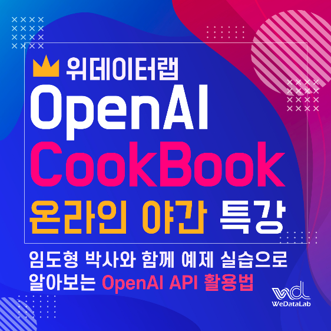

# 개요
ChatGPT의 모델을 프로그래밍 적인 방법으로 호출할 수 있는 OpenAI API의 사용 호출예 사이트 OpenAI CookBook의 예를 가지고
ChatGPT의 기능과 이외의 기능을 사용하는 방법을 공부합니다.

  
 

# 커리 큘럼
- 1회차
    - ChatGPT 소개
    - OpenAI API 소개
    - OpenAI CookBook 소개
    - 계정 생성과 설정
    - 실습 환경 소개

- 2회차
    - 기본적인 호출 방법
    - 세션 유지 방법

- 3회차
    - 토크나이징 소개와 방법
    - 임베딩 소개와 방법    

- 4회차
    - 임베딩을 사용한 검색 방법
    - 임베딩을 사용한 분류 방법
    - 임베딩을 사용한 추천 방법

- 5회차
    - 파인 튜닝 방법

- 6회차
    - SQL 생성 방법
    - Latex 문서의 번역 방법

- 7회차
    - 비동기적 처리 방법
    - 호출 시의 rate limit 처리 방법
    - 배치 처리 방법

- 8회차
    - 사용자의 문서에 대한 QnA 엔진 개발 실습

 

[회자별_실습내용.md](회자별_실습내용.md)

 

# 자료
- [ChatGPT_소개.pdf](ChatGPT_소개.pdf)
- GPT 구조 : [from_DNN_to_GPT.pptx](from_DNN_to_GPT.pptx)
- 실습 준비 : [OpenAI_계정만들기_키만들기_결제정보_입력.pdf](OpenAI_계정만들기_키만들기_결제정보_입력.pdf)
- [OpenAI_API_사용_기초.pdf](OpenAI_API_사용_기초.pdf)

 

# 주요 링크
- OpenAI 홈 : https://openai.com/
- ChatGpt 홈 : https://chat.openai.com/
- OpenAI Platform 홈 : https://platform.openai.com/
    - API 레퍼런스 : https://platform.openai.com/docs/api-reference
    - 웹에서 설명한 사용 예제 : https://platform.openai.com/examples
- OpenAI API CookBook : https://github.com/openai/openai-cookbook

